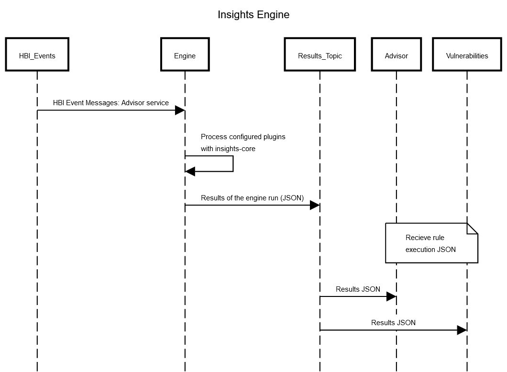

# Insights Engine

Insights Engine is a frontend for insights-core-messaging that can consume
archives from a topic on kafka and produce results to a topic on kafka.

-v enables verbose logging

## Details

The Engine is a component of the Insights Platform that extracts results from advisor archives detailing any issues the system may be experiencing. It downloads archives via the `url` field of incoming messages and runs insights-core against them with loaded plugins.

The app is configured primarily by a config file (config.yaml in this repo is an example) and, in the case of the platform, environment variables.

### Diagram

# Technology Stack
  - This service is written in python
    - Use confluent-kafka to pull or publish kafka messages
    - Use prometheus-client to communicate with prometheus instance
    - Use watchtower to save logs

# Podman

## Podman Build

In order to build the container image, clone the following repos into this directory:

    git clone git@github.com:RedHatInsights/insights-core.git
    git clone git@github.com:RedHatInsights/insights-core-messaging.git

You'll also need plugins to run against the archives. You can write your repo link into core_and_plugin.txt.

Run the build:

    podman build . -t insights-core-engine:latest

## Podman Run

To run the image, ensure you have a kafka service running and accessible via `kafka:29092`. You can
also edit the config to point to the kafka bootstrap server of your choice.

    podman run -it --name engine --rm insights-core-engine:latest

## Contributing

Since Engine is largely based on code from [Insights Core Messaging](https://www.github.com/RedHatInsights/insights-core-messaging), a lot of the changes that might be needed could be explored there as well.

# Release

`insights-engine`
Deploying to stage is done automatically when a commit is pushed to the `master`
branch. Deploying to production is done manually.  

